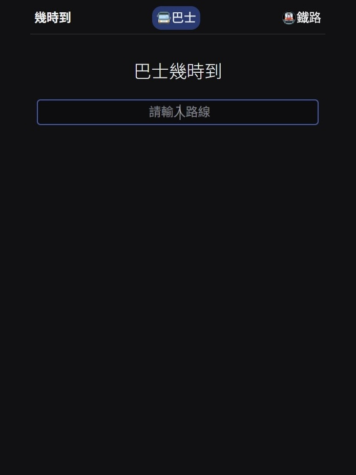
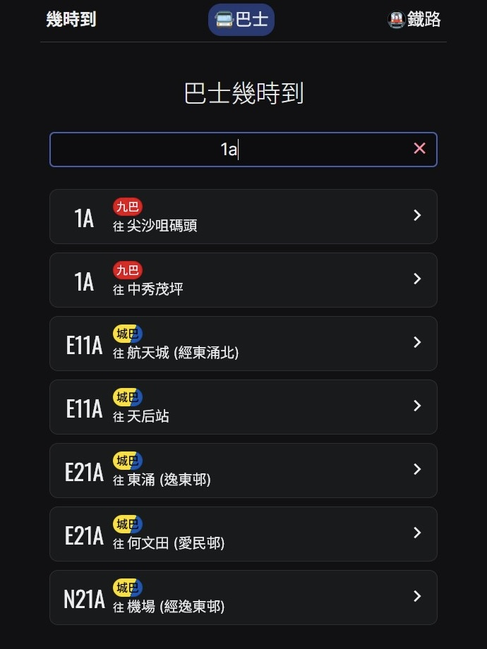
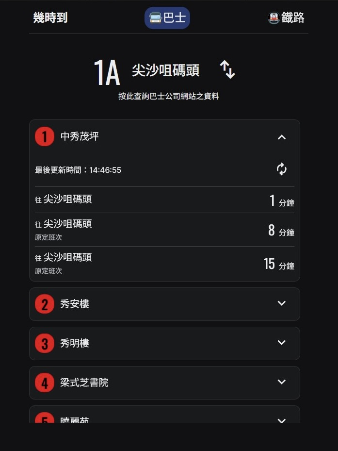
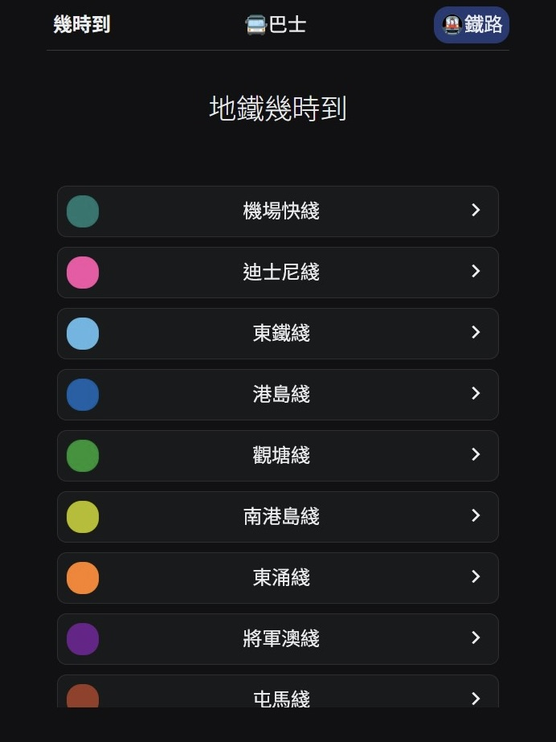
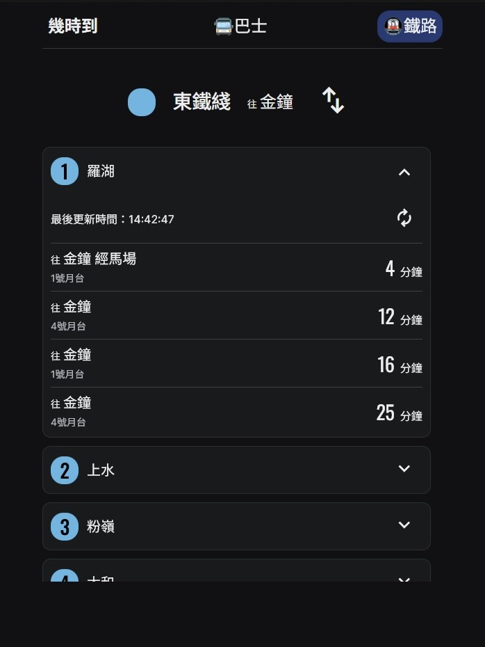

# Check ETA 幾時到

Check ETA(Chinese: 幾時到) is a React app that allows users to check the estimated time of arrival (ETA) for buses and metros in Hong Kong.

This app can check the ETA of these companies for now:
- [KMB](https://www.kmb.hk/)
- [LWB](https://www.kmb.hk/)
- [Citybus](https://www.citybus.com.hk/home/default.aspx?intLangID=2)
- [MTR](https://www.mtr.com.hk/ch/customer/main/index.html)

This app uses data from [data.gov.hk(資料一線通)](https://data.gov.hk/). 
Please note that this application is currently under development, and the information provided may be indicative. 
For up-to-date information, please visit the official website.

## Usage

### For Bus

1. Search the route you want to check
2. Choose the route

3. Choose the stop

You can:

- Swap the route direction
- Get the latest ETA

### For Metro

1. Choose the line you want to check

2. Choose the stop 

You can:

- Swap the line direction
- Get the latest ETA 

## Acknowledgments

-   [data.gov.hk(資料一線通)](https://data.gov.hk/)
-   [Radix UI](https://www.radix-ui.com/)
-   [React](https://react.dev/)
