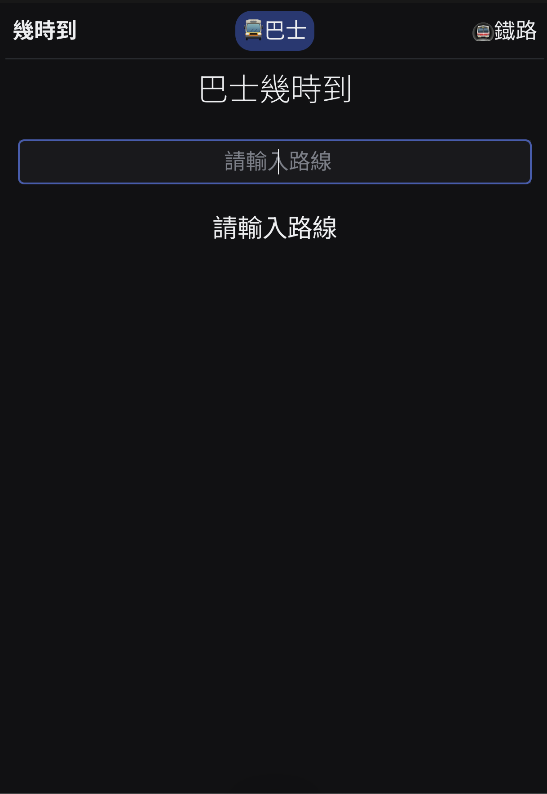
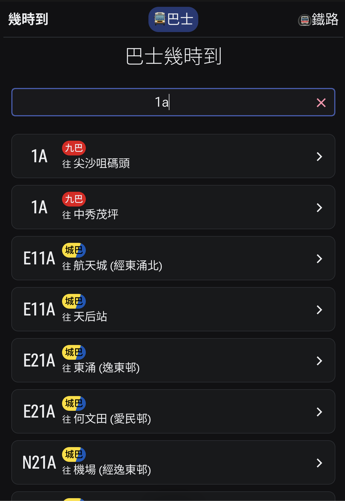
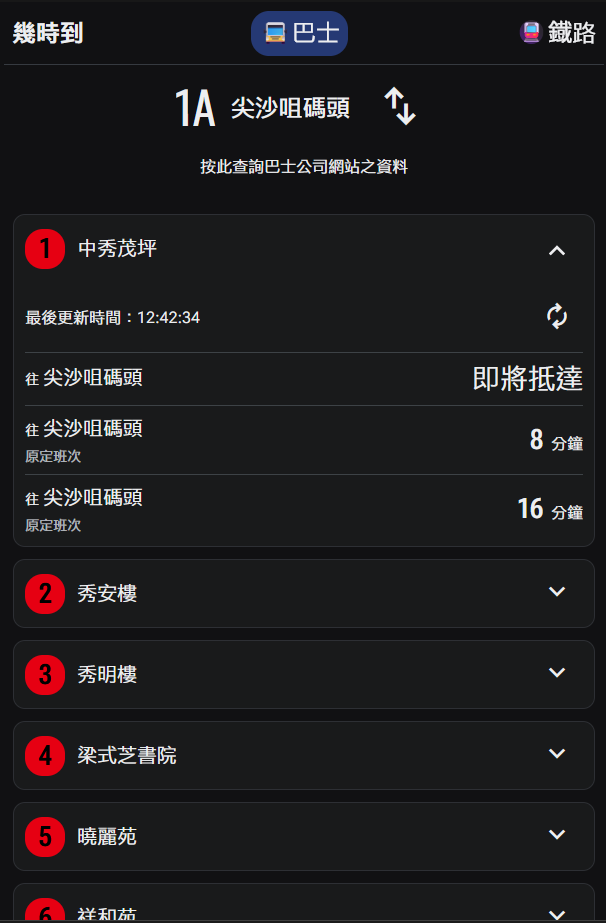
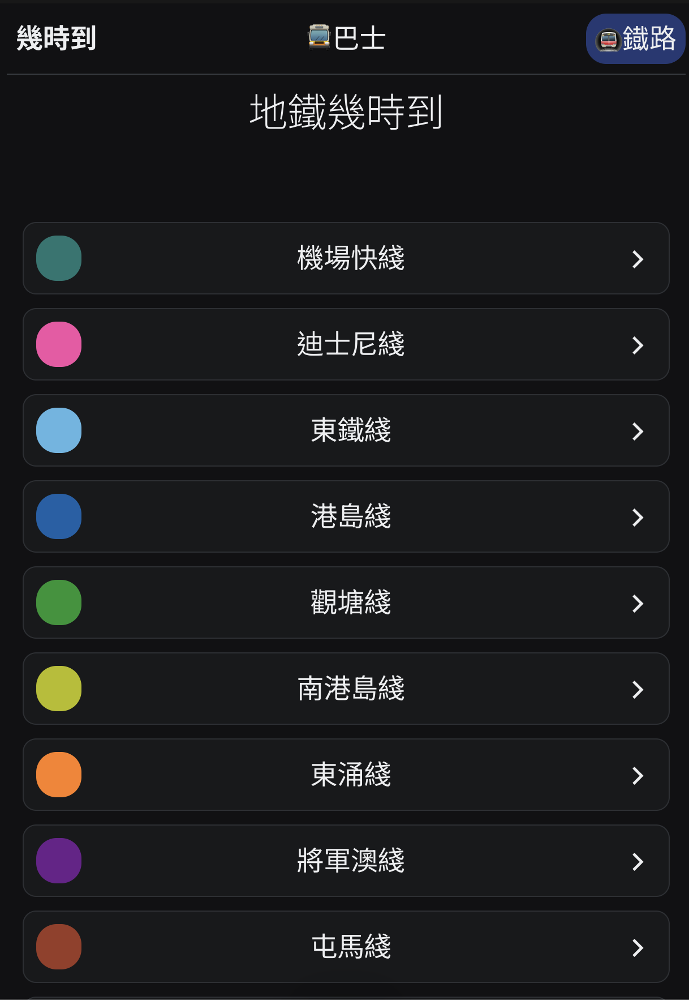
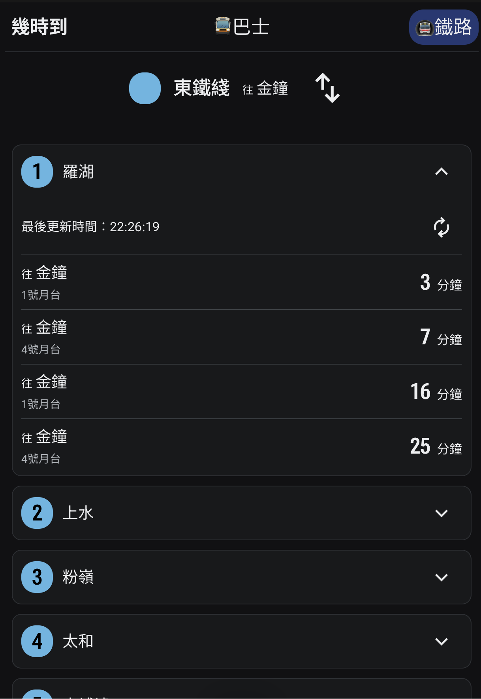

# Check ETA 幾時到

Check ETA is a React app that allows users to check the estimated time of arrival (ETA) for buses and metros in Hong Kong.

幾時到是一個 React 應用程式，您可以使用此應用程式查詢香港的巴士以及地鐵的預計到達時間(ETA)。

This app can check the ETA of these companies for now:

本應用程式現可查詢以下公司的ETA：

-   [KMB](https://www.kmb.hk/)
-   [LWB](https://www.kmb.hk/)
-   [Citybus](https://www.citybus.com.hk/home/default.aspx?intLangID=2)
-   [MTR](https://www.mtr.com.hk/ch/customer/main/index.html)

This app uses data from [data.gov.hk(資料一線通)](https://data.gov.hk/).
Please note that the information provided may be indicative as this application is still under development.
For up-to-date information, please visit their official website.

本應用程式的資料來源為[data.gov.hk(資料一線通)](https://data.gov.hk/)。
資料僅供參考。請前往各公司網站查詢最新資訊。

## Usage

### For Bus 查詢巴士

1. Search the route you want to check
   搜尋想查詢的巴士路線
2. Choose the route
   選擇路線

3. Choose the stop
   選擇巴士站

-   You can swap the route direction
    可以調轉方向
-   ETA will be updated every 60 sec. You can also get the latest ETA by clicking the update button.
    ETA 每六十秒自動更新一次，亦可以手動取得最新的 ETA

### For Metro 查詢地鐵

1. Choose the line you want to check
   選擇您想查詢的路線

2. Choose the stop
   選擇地鐵站

-   You can swap the line direction
    可以調轉方向
-   ETA will be updated every 30 sec. You can also get the latest ETA by clicking the update button.
    ETA 每三十秒自動更新一次，亦可以手動取得最新的 ETA

## Acknowledgments

-   [data.gov.hk(資料一線通)](https://data.gov.hk/)
-   [Radix UI](https://www.radix-ui.com/)
-   [React](https://react.dev/)
